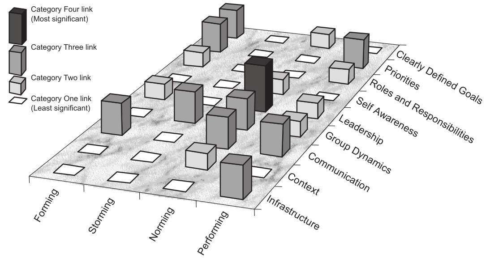

# how_to_organize_a_retreat

How to organize a retreat, with the goal of teambuilding, using the academic literature.

This is an academic literature search on how to organize a retreat
and related matters.

## An effective team: key characteristics

### Project Aristotle

From Google's Aristotle project, 
top 5 most important things for an effective team, 
most important ones first:

 * Psychological safety:  Team members must be comfortable in taking risks and speaking their minds. They need to know that their team members will support their actions and not ridicule them. Everyone on the team has to feel as though they won’t be made examples of if something doesn’t go right which they suggested or promoted.
 * Dependability: Everyone needs to contribute to the best of their ability and
 * Deliver high quality work. They must do this within the time parameters allotted and agreed upon. Dependability means that they can count on each other to do their job.
 * Structure and clarity: Clear direction and goals is vital. Everyone needs to understand what part they play on the team. Everyone on the team also needs to understand how they should go about getting their job done so as to help the team succeed.
 * Meaning of work: Google’s researchers seemed to find that individual personal satisfaction in the job they were performing was also a key element in the success of the team. I find that this falls in line with a lot of the material in Daniel Pink’s Drive which speaks to what motivates us as humans.
 * Impact of work: How does the work that people are doing actually benefit the company?  Team members want to feel that they are not simply wasting their time when doing things. This again supports many ideas in Daniel Pinks’ book.

### [Sheard & Kakabadse, 2002]

Also, [Sheard & Kakabadse, 2002] suggest the nine key factors of an effective team:

Key factor                |Loose group                                 |Effective team
--------------------------|--------------------------------------------|----------------------------------------
Clearly defined goals     |Individuals opt out of goals not understood |Understood by all
Priorities                |Split loyalty of individuals to other groups|Cohesive team alignment
Roles and responsibilities|Unclear, with gaps and overlap              |Agreed and understood by individuals
Self-awareness            |Individuals guarded                         |Behaviour appropriate to team needs
Leadership                |Directive                                   |Catalytic
Group dynamics            |Individuals guarded                         |Social system established and accepted
Communications            |Formal                                      |Open dialogue
Content                   |Task focused                                |Influenced, but not controlled, by organisation
Infrastructure            |Task focused                                |Stable support from organisational infrastructure

> Table I. The nine key factors of an effective team. From [Sheard & Kakabadse, 2002]

> Figure 4: The validated team landscape. From [Sheard & Kakabadse, 2002]

## An ineffective team: key characteristics

 * [Lencioni, 2005] Team dysfunction #1/5: **Absence of Trust**. This outcome occurs when team members are reluctant to be vulnerable with one another and are unwilling to admit their mistakes, weaknesses, or need for help. Without a certain comfort level among team members, a foundation of trust is not possible.
 * [Lencioni, 2005] Team dysfunction #2/5: **Fear of Conflict**. Teams that are lacking trust are incapable of engaging in unfiltered, passionate debate about key issues. It creates situations where team conflict can easily turn into veiled discussions and back channel comments. In a work setting where team members do not openly air their opinions, inferior decisions result.
 * [Lencioni, 2005] Team dysfunction #3/5: **Lack of Commitment**. Without conflict, it is difficult for team members to commit to decisions, fostering an environment where ambiguity prevails. Lack of direction and commitment can make employees, particularly star employees, disgruntled and disenfranchised.
 * [Lencioni, 2005] Team dysfunction #4/5: **Avoidance of Accountability**. When teams do not commit to a clear plan of action, even the most focused and driven individuals are hesitant to call their peers on actions and behaviours that may seem counterproductive to the overall good of the team.
 * [Lencioni, 2005] Team dysfunction #5/5: **Inattention to Results**. Team members naturally tend to put their own needs (e.g., ego, career development, recognition, and so on) ahead of the collective goals of the team when individuals are not held accountable. If a team has lost sight of the need for achievement, the business ultimately suffers.

## An effective team: how to get there?

Conditions that optimize the effectiveness of the team [Hackman, 2002]:

 * **Real Team** – Stability in the group membership over time
 * **Compelling Direction** – A clear purpose that relies on end goals
 * **Enabling Structure** – The groups dynamic must be producing good, not bad
 * **Social Support** – The group must have a system to collaborate properly
 * **Coaching** – Opportunities for a coach to give help [17]

From [Stoller et al., 2004]:

 * 1 [Stoller et al., 2004] Challenging the process
   * a Search out challenging opportunities to change, grow, innovate, and improve.
   * b Experiment, take risks, and learn from the accompanying mistakes.
 * 2 [Stoller et al., 2004] Inspiring a shared vision
   * a Envision an uplifting and ennobling future.
   * b Enlist others in a common vision by appealing to their values, interests, hopes, and dreams.
 * 3 [Stoller et al., 2004] Enabling others to act
   * a Foster collaboration by promoting cooperative goals and building trust.
   * b Strengthen people by giving power away, providing choice, developing competence, assigning critical tasks, and offering visible support.
 * 4 [Stoller et al., 2004] Modeling the way
   * a Set the example by behaving in ways that are consistent with shared values.
   * b Achieve small wins that promote consistent progress and build commitment.
 * 5 [Stoller et al., 2004] Encouraging the heart
   * a Recognize individual contributions to the success of every project.
   * b Celebrate team accomplishments regularly.

## Team development stages

Team development stage (stages from [Tuckman, 1965]) |Leadership strategies |Keys to success (from [Manges et al., 2017])
-----------------------------------------------------|----------------------|------------------------------------------------------
Forming                                              |Coordinating behaviors|Purposefully picking the team
(setting the stage)                                  |.                     |Facilitating team to identify goals
.                                                    |.                     |Ensuring the team development of a shared mental model
Storming                                             |Coaching behaviors    |Act as a resource person to the team
(resolving conflict and tension)                     |.                     |Develop mutual trust
.                                                    |.                     |Calm the work environment
Norming and performing                               |Empowering behaviors  |Get feedback from staff
(successfully implementing and sustaining projects)  |.                     |Allow for the transfer of leadership
.                                                    |.                     |Set aside time for planning and engaging the team
Outperforming and adjourning |Supporting behaviors   |Allow for flexibility in team roles
(expanding initiative and integrating new members)   |.                     |Assist in the timing and selection of new member
.                                                    |.                     |Create future leadership opportunities 

> Team development stages, leadership strategies and keys to success, from [Manges et al., 2017]

## Team building

### Usefulness

 * [Klein et al., 2009] Process and affective outcomes were most improved by team-building interventions.

### General approaches

Approaches to team building:[Salas & Priest, 2004]:

 * **Setting goals**: This emphasizes the importance of clear objectives and team goals. Team members become involved in action planning to identify ways to define success and failure and achieve goals. This is intended to strengthen motivation and foster a sense of ownership. By identifying specific outcomes and tests of incremental success, teams can measure their progress. Many organizations negotiate a team charter with the team and (union leaders)
 * **Role clarification**: This emphasizes improving team members' understanding of their own and others' respective roles and duties. This is intended to reduce ambiguity and foster understanding of the importance of structure by activities aimed at defining and adjusting roles. It emphasizes the members' interdependence and the value of having each member focus on their own role in the team's success.
 * **Problem solving**: This emphasizes identifying major problems
 * **Interpersonal-relations**: This emphasizes increasing teamwork skills such as giving and receiving support, communication and sharing. Teams with fewer interpersonal conflicts generally function more effectively than others. A facilitator guides the conversations to develop mutual trust and open communication between team members. 

### How to organize a retreat

 * [Malvicini & Serrat, 2017] **Start at the End**. Know what you want from your retreat, “your intended outcomes,” and how you will follow up the event. Work with a Strategic planning group in your unit and be clear about these outcomes from the beginning. Be careful not to define predetermined results: instead choose a focus to guide your work: “a plan to implement x,” “a new strategy for y,” “actions to strengthen workflows and business processes,” etc.
 * [Malvicini & Serrat, 2017] **Get Away**. Allow some physical or psychological distance from the office and see what happens. If you are on-site, distractions can undermine work and preserve the formality one is trying to break down. (The reasons for this are straightforward: (i) retreats require long periods of intense, uninterrupted discussion; (ii) participants are less likely to be interrupted by phone calls and other staff if they are away from the office; (iii) participants can better focus on the topics under discussion; (iv) participants are more like to stay for the entire time; and (v) being “away on retreat” creates a atmosphere that is more conducive to teamwork, creative thinking, and consensus building.) Crossing the street is better than going nowhere. If working for a couple of days try something further afield —the cost is small compared with the gain from the energy and continuity you create. The intensive effort and concentrated time staff can give to an effort normally pays off. The work and fun had in two 10h days off-site gains more than two six hour days on-site and much more than weekly committee meetings for a year.
 * [Malvicini & Serrat, 2017] **Suspend the Rules**. The workplace carries sets of unspoken rules and implied norms of behavior, especially when dealing with people of different position and status within the hierarchy. At least during your retreat, remove these boundaries and create broad ownership of the task as a team. During introductions make this clear. Rein in any dominant senior personnel and let participants see how important it is that all have a voice. And please leave formal business dress behind.
 * [Malvicini & Serrat, 2017] **Work as a Team**. Retreats are special. So do not organize them like a two-day staff meeting or a symposium. If participants are passive, they will lose interest even in the most captivating speakers. Information sharing is more effective by print through a briefing pack for the event. Short briefings are useful as background for an activity, but spend most of your time in deliberation, preferably in smaller groups, and large group discussion of those ideas.
 * [Malvicini & Serrat, 2017] **Discuss the “Undiscussable”**. All units have concerns not normally put on the table (but everyone is aware of them)—typically these issues are a barrier to productive work. A retreat can be a time to work on these areas positively and productively. Discussions in smaller groups can help staff vent any frustrations and then return to the larger group with practical solutions. Do not miss a chance to do important work and break through a serious bottleneck to effectiveness.
 * [Malvicini & Serrat, 2017] **Keep it Real**. Do real work. As much as possible, avoid simulations, abstract discussions, and lectures from experts. Real tasks energize participants, combined with challenging matters that concern them most, and a process that lets them question, deliberate, and refine their ideas and actions. “Experts” can be useful as resource persons to serve the task, but many find the combined expertise of their staff to be more than adequate for the job.
 * [Malvicini & Serrat, 2017] **Do Not Play Games**. (Just Have Fun) By design, a retreat is less formal than the workplace. That informality is one way of engaging people and creating a safe environment. Game-playing may send mixed signals, especially when the organization’s culture views them as silly. Creative ways of working with small groups or teams and creative ways of presenting ongoing work will allow the humor of participants to break through spontaneously—this can be useful especially when dealing with difficult topics and concerns. This is also an effective way of indirect teambuilding.
 * [Malvicini & Serrat, 2017] **Mix it Up**. Variety will hold the interest of participants. Try different size discussion groups, different small group processes, and different ways of sharing group outputs. Avoid organizing things the same way you would back at the workplace. People learn and plan differently—create opportunities for all participants.
 * [Malvicini & Serrat, 2017] **Think Big**. By stepping away from work routine, participants have a chance to rediscover the meaning and motivation for their daily work. Whenever possible, allow all staff to envision the future of the organization—they can build a shared understanding, and this is powerful. Staff then move swiftly from a “bird’s eye view” of desired outcomes and goals, translating them into concrete results.
 * [Malvicini & Serrat, 2017] **Think Small**. Staff and management want concrete results. Discussing the “nuts and bolts” of implementation means the difference between real follow-up and good intentions. There will not be time to consider all details. But, draft basic timetables and share responsibility for follow-up tasks before you leave the retreat.
 * [Malvicini & Serrat, 2017] **Just Do It**. Deliberation is great. Deliberative action is better. The climax of a good retreat should be decisions for new action. A poorly planned retreat will not leave enough time for this and the lack of follow-up will be obvious.
 * [Malvicini & Serrat, 2017] **Get Professional Help**. Planning your retreat need not drive you insane. Most organizations can benefit from using a facilitator with expertise in group dynamics, group processes, team building, decision making, and consensus building. He or she will help plan the retreat, develop the agenda, and set realistic goals and expectations. During the retreat the facilitator will manage or facilitate group discussions.2 The facilitator should have no particular stake or interest in the issues being discussed. His or her sole interest should be in helping the group have a successful retreat. During the retreat, the facilitator will also function as a recorder for the group by capturing the key points on a flip chart or on computer. After the retreat, the facilitator will generally provide the group with a written report summarizing the discussions, any decisions that were made, and action steps to be taken. If no professional facilitators is available, consider training members of your unit or borrow (or swap) experienced facilitators from other units.
 * [Bower, 2004] **Have a clear goal**. The aim of the retreat should be clear and commonly revolves around taking the opportunity to reflect, interact, and build relationships.
 * [Bower, 2004] **Balance structured and unstructured activities**. There needs to be a balance between structured activities and unstructured opportunities for self-activated activities and interactions.
 * [Bower, 2004] **Have time between structured activities**. Spaces between structured activities allow individuals to let go of background demands and responsibilities at a pace they can manage.
 * [Bower, 2004] **Initiate trust**. Trust has to be initiated by the facilitators and extended by participant good will, sharing, and dialogue.
 * [Bower, 2004] **Have the right amount of participants** The number of participants should be large enough for diverse perspectives, but small enough for good quality interactions.
 * [Bower, 2004] **Have clear, minimal and acceptable rules**. Rules need to be clear, minimal, and acceptable to all.
 * [Bower, 2004] **Everyone try their best**. Those in attendance must have a commitment to participate to the best of their ability.
 * [Bower, 2004] **Schedule informal talk**. Sufficient time should be allocated for participants to get to know each other in fun or active ways that are different to work place modes.
 * [Bower, 2004] **Integrate newcomers**. If the organization has held retreats before, then the early structured exercises will predominantly aim to integrate newcomers with previous participants.
 * [Bower, 2004] **Expect unexpected ideas**. Participants need to be aware that the thoughts and insights individuals experience during reflective activities can be unanticipated (adapted from Bower, Citation2004).

## References

 * [Bower, 2004] Bower, Kathleen A. "Retreats as a foundation for change: The global nursing exchange as a retreat." Nursing Administration Quarterly 28.1 (2004): 3-5. [here](https://journals.lww.com/naqjournal/fulltext/2004/01000/retreats_as_a_foundation_for_change__the_global.2.aspx)
 * [Cleary & Horsfall, 2015] Cleary, Michelle, and Jan Horsfall. "Teamwork and teambuilding: considering retreats." Issues in Mental Health Nursing 36.1 (2015): 78-80., [here](https://www.tandfonline.com/doi/full/10.3109/01612840.2014.981432)
 * [Hackman, 2002] Hackman, J. Richard. Leading teams: Setting the stage for great performances. Harvard Business Press, 2002.
 * [Hackman, 2006] Hackman, J. Richard. "The five dysfunctions of a team: A leadership fable." (2006): 122-125.
 * [Klein et al., 2009] Klein, Cameron, et al. "Does team building work?." Small group research 40.2 (2009): 181-222.
 * [Lencioni, 2005] Lencioni, Patrick. "The Five Dysfunctions of a Team (2002)." Overcoming the Five Dysfunctions of a Team (2005).
 * [Malvicini & Serrat, 2017] Malvicini, Peter, and Olivier Serrat. "Conducting successful retreats." Knowledge Solutions (2017): 847.
 * [Manges et al., 2017] Manges, Kirstin, Jill Scott‐Cawiezell, and Marcia M. Ward. "Maximizing team performance: the critical role of the nurse leader." Nursing forum. Vol. 52. No. 1. 2017.
 * [None, no full text] Cowart, Taylor, and Neil Baum. "It's Not Obsolete to Have a Practice Retreat." The Journal of Medical Practice Management: MPM 38.4 (2023): 160-162.
 * [Salas & Priest, 2004] Salas, Eduardo, Heather A. Priest, and Renée E. DeRouin. "Team building." Handbook of human factors and ergonomics methods. CRC Press, 2004. 491-496.
 * [Stoller et al., 2004] Stoller, James K., et al. "Teambuilding and Leadership Training in an Internal Medicine Residency Training Program: Experience with a One‐day Retreat." Journal of general internal medicine 19.6 (2004): 692-697. [here](https://onlinelibrary.wiley.com/doi/full/10.1111/j.1525-1497.2004.30247.x)
 * [Sheard & Kakabadse, 2002] Sheard, A. G., and A. P. Kakabadse. "From loose groups to effective teams: The nine key factors of the team landscape." Journal of Management Development 21.2 (2002): 133-151.
 * [Tuckman, 1965] Tuckman, Bruce W. "Developmental sequence in small groups." Psychological bulletin 63.6 (1965): 384.

